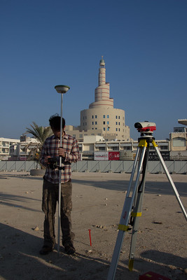
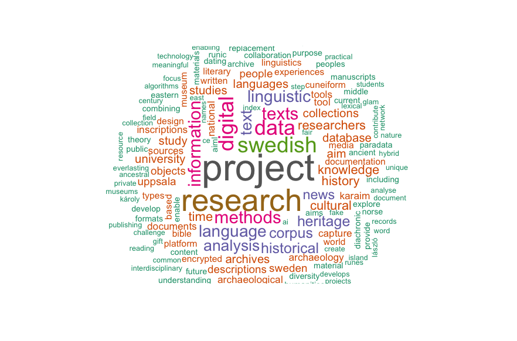
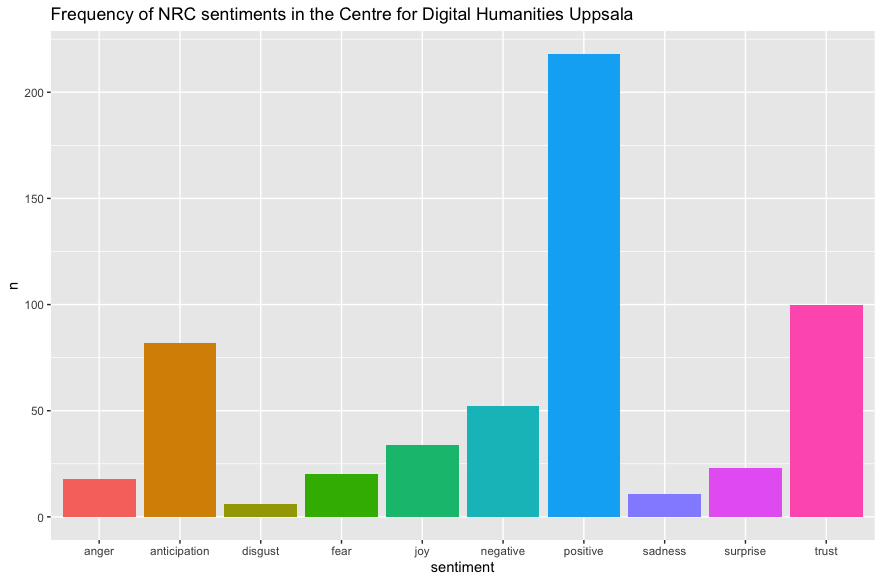
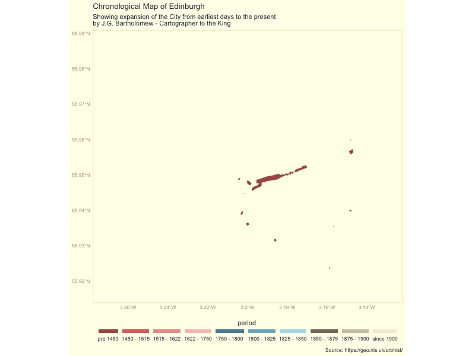

```{r setup, include=FALSE}
options(htmltools.dir.version = FALSE)
```

```{r xaringan-themer, include=FALSE, warning=FALSE}
library(xaringanthemer)

style_solarized_light(background_color = "white")

```

class: center, middle
# How It Started...
```{r, echo=FALSE,fig.align='center'}

```

---
class: center, middle
# How It's Going 
```{r, echo=FALSE, out.height=450, out.width= 700, fig.cap="", fig.align='center'}
knitr::include_graphics("https://function.xkcd-excuse.com/media/47495320414e414c595354-4152434d4150204953204e4f5420524553504f4e44494e47-52455354415254494e47.png")
```

---

# CDHU

```{r, echo=FALSE, out.width= 600, fig.cap="Top 100 words in CDHU projects descriptions ", fig.align='center'}

```

---

# CDHU

```{r, echo=FALSE, out.width= 600, fig.cap="Sentiments in CDHU projects Descriptions ", fig.align='center'}

```

---
# Data Management
 
 .pull-left[
**Software and Platforms**
* MS Access / SQLite
* Oracle / Postgresql
* HeDAP / Arches 
* Pastmap / Canmore
* ArcGIS for Server, Geoserver
* SENECHAL - Heritage Linked Data Vocabularies (more api)
* HES Database, CLASS Database
* curation of Listed Buildings, Scheduled Monuments, Conservation 
]

.pull-right[
**Data Standards and Formats**
* EU Inspire - Discovery View Services
e.g.LiDAR - INSPIRE Annex II Elevation Theme specifications
* Data Concordance/UK Gemini / MIDAS - Heritage / FAIR
* Scottish Spatial Data Infrastructure 
* CIDOC-CRM and extensions (Fuwairit in Qatar)
]

CDHU: URDAR, CAPTURE
---
 # Historical Visualizations
 
.pull-left[
```{r, echo=FALSE, out.width= 600, fig.cap="Chronological Map of Edinburgh ", fig.align='center'}

```

]

.pull-right[

* The Story of Perth - What? Where? When?
 NLS Maps, georeferencing, Maptiles

* DOHA - Doha Online Historical Atlas
Leaflet.js, public engagement, 

]

---

 # Spatial Analysis
 
.pull-left[

**Spatial Analysis**

* applied spatial analysis using ArcGIS and QGIS

* geocomputation in Python and R

* Machine Learning e.g. DBSCAN

]

.pull-right[

**Analytical  Platforms**

* Workbench
* AWS / Azure 
* Bridging R, Python and GIS Software


]
---
.pull-left[
**Teaching**

* Carpentries Instructor
* Data Science Accelerator Mentor
]

.pull-left[
**Research**

* Imperial Landscape in the Near East 
* open access, open methods and open data
* reproducible research (R package development)
]

CDHU: GLoW, Archaeology - Global Historical Ecology
---
layout: false
class: inverse, middle, center

## Thank you

### Me:

@topographos2

https://github.com/topographos/

### Code:

https://github.com/topographos/uppsala